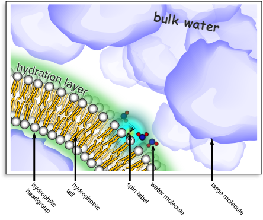

# {{page.title}}

- [Background](#background) -- why water near a macromolecule's surface
  behaves so differently from bulk water, and why that matters for
  chemistry and biology.

#### Projects

- [Open Instrumentation (New
  Initiative)](#open-instrumentation-new-initiative) -- affordable,
  sensitive open NMR instrumentation as real-time "eyes" for autonomous
  chemistry.
- [Spin Physics for Low-Field
  NMR](#spin-physics-for-low-field-nmr) --
  applying our quantitative understanding of ODNP and the DCCT technique
  to get clean, quantitative signal out of noisy, low-cost, low-field
  magnets.
- [Temperature-Controlled ODNP in Reverse
  Micelles](#temperature-controlled-odnp-in-reverse-micelles)
  -- reverse micelles as a tunable model system for confined water and
  protein-surface hydration.

- [References](#references) -- works cited above, numbered as they
  appear on this page.

## Background

Even though water appears uniform
    on a macroscopic scale,
    it behaves quite differently
    on the nanoscale.
If we zoom in to the first few layers of water
    molecules near the surface of a protein or polymer
    (in fact, near any macromolecule or macromolecular assembly),
    we see that
    hydrogen bonds break
    and
    individual water molecules move
    at rates
    anywhere from two times
    slower to hundreds of times slower than those in the bulk
    liquid.
We know that these differently behaved "hydration waters" are
    key to determining interactions.

The future of physical and analytical chemistry
    will center on the fact that,
    while tools have been developed for
    characterizing static structures,
    we still need techniques that can study
    dynamic arrangements of molecules
    and, most urgently,
    the arrangement
    of water molecules.

Comprehensive methods for mapping out
    the structure of the hydration layer do not
    currently exist.
The future of chemistry, broadly, depends on
    techniques that will map out the structure
    of the dynamic solvent that surrounds
    macromolecules.
The resulting insight will improve our ability
    to design drugs and synthetic materials.
In particular,
    by developing technologies that can map out the
    dynamic structure of hydration water,
    we unlock an ability to design drugs that bind to
    proteins currently deemed "undruggable,"
    we can understand the energetics that cause
    signaling proteins to bind to their partners,
    and design polymer materials that conduct water in
    unique ways.

Most chemists and biologists recognize one very
    simple example of hydration water:
the layer of water surrounding oil molecules
    that drive the separation of water and oil.
    But the more general case,
    especially for macromolecules that present a
    surface with variable properties to the solvent,
    is far more interesting and far less understood.

**How do proteins alter nearby solvent?**
Proteins are the molecular motors
    that drive all life,
    and most drugs are designed to interact with
    proteins.
It is increasingly clear that water molecules
    at the surface of proteins control their
    structure and function;
    while researchers have developed methods that
    can study the structure of proteins,
    there are no accessible methods to spatially
    map the hydration water.
We develop and apply magnetic-resonance-based
    spectroscopic methods for routine, robust,
    and accessible measurements of the properties
    of these key hydration water molecules.

**A fundamental example.**
As a fundamental example,
    consider lipid bilayers
    -- structures that make up cell membranes.
Dr. Franck and his colleagues previously developed a specialized technique to
    characterize water near the bilayer surfaces.
Our technique
    -- called Overhauser Effect Dynamic Nuclear
    Polarization (ODNP)  --
    tracks the motion of the water nuclei,
    and allows us to zoom in on the
    "hydration water" near the surface of the lipid bilayer
    (figure below).
It allowed them to
    see that the hydration water moves about 5
    times slower than bulk water .
Furthermore, by dramatically
    changing the characteristics of the bulk
    solution,
    we learned that
    an order of magnitude change in the viscosity
    barely affects the diffusion in the hydration
    layer .
They have also implemented this technique
    in systems with membrane proteins ,
    DNA ,
    and large protein folding chaperones .
The significant variations in the properties of the
    hydration water play in important role in how these surfaces
    interact in nature.

*This image illustrates ODNP of water in the hydration layer of a
    lipid bilayer.
This is one example of many studies that are possible with ODNP.
A lipid bilayer (the basis for cellular membranes) consists of a
    self-organized set of molecules with hydrophilic headgroups
    and hydrophobic tails (see labels above).
One can place a spin label (typically a nitroxide group)
    at a particular location near the surface of the lipid
    bilayer (via chemical synthesis).
A combination of electron- and nuclear-spin resonance
    (i.e. ODNP)
    can selectively interrogate the motion of water molecules
    at a specific location --
    here inside the hydration layer of
    the lipid bilayer.
For example, employing the setup shown above,
    we were able to verify that the motion of water molecules
    within the hydration layer was not sensitive to the presence
    of a high concentration of large molecules
    that are not chemically disposed to disrupt the hydration layer.
This was even true when the large molecules significantly altered the
    viscosity of the bulk solution .*

In the Franck lab, we currently push the limits of the ODNP technique to
retrieve new and more detailed information about hydration water, drawing on
expertise in spectrometer design and advanced magnetic resonance methods
 that we have already distilled into a
cogent, quantitative explanation of the ODNP technique itself
. That work is organized into three projects,
described below.

## Open Instrumentation (New Initiative)

{: .project-logo }

Since joining ACERT, we've launched a new initiative built around the
observation that autonomous chemistry labs need real-time, quantitative
feedback on what's actually happening in a reaction -- the "eyes" that let a
robot check its own work -- and that today's benchtop NMR instruments aren't
sensitive, flexible, or affordable enough to provide it.

We design inexpensive, customizable, yet sensitive open instrumentation
, an approach very much
aligned with ACERT's mission of making advanced magnetic resonance broadly
accessible.

## Spin Physics for Low-Field NMR

We draw on our expertise in advanced spin physics: applying our quantitative
understanding of the Overhauser effect together with the DCCT technique
, which extracts clean, multiplexed signal from
the noisy, inhomogeneous fields typical of low-cost, low-field magnets
.
Together, these let us push sensitive, quantitative magnetic resonance into
settings -- like an autonomous synthesis robot -- where it was previously
impractical.

## Temperature-Controlled ODNP in Reverse Micelles

We are investigating the water on the insides of reverse micelles, which
provide controllable, temperature-tunable pockets of confined water and serve
as our model system for confinement effects more broadly
.
Atahan Garip is extending this program by developing a fully open and
automated temperature-controlled ODNP system, purpose-built for these
measurements.

When nanoscale aggregates such as reverse micelles isolate small pockets of
water, the resulting confinement alters the hydrogen bonding network; meanwhile,
the confinement also slows down the motion of the water molecules. These
effects result in a change (respectively) of the electron cloud density and of
the lifetime of the spin states, and magnetic resonance can measure both of
these. We have developed a measurement that reads out the *correlation*
between the hydrogen bonding strength and the rotational motion in confined
water pools. By measuring this correlation as a function of the size of the
water pool, we've identified a distinct inflection point at a couple
nanometers at which the water matrix changes dramatically.

We also continue to map out more subtle details in the water along the
surface of proteins, both globular signaling proteins as well as
trans-membrane proteins, employing mutagenesis to attach a spin label at a
series of sites on the surface of proteins, including cancer signaling
proteins (KRas) as well as transmembrane proton pumps (proteorhodopsin). This
allows us to create a set of samples that are primed for measurement of water
at a series of different sites, so that we can watch how the translational
diffusivity of the water changes as we move from site to site along the
surface.

## References

<a href="Publications.html">See the Publications
page for our complete list of publications</a>


