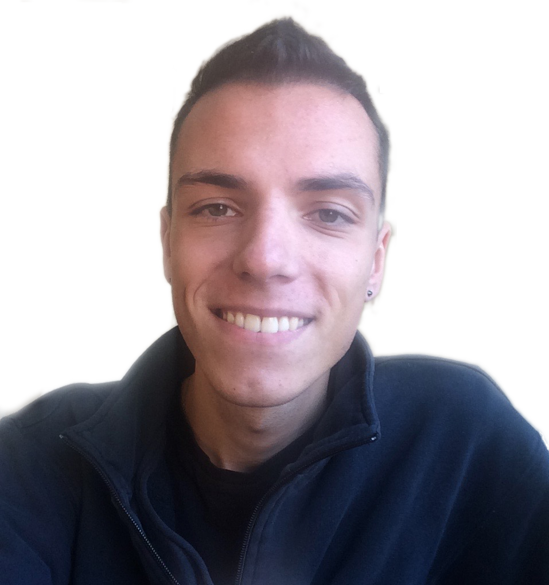
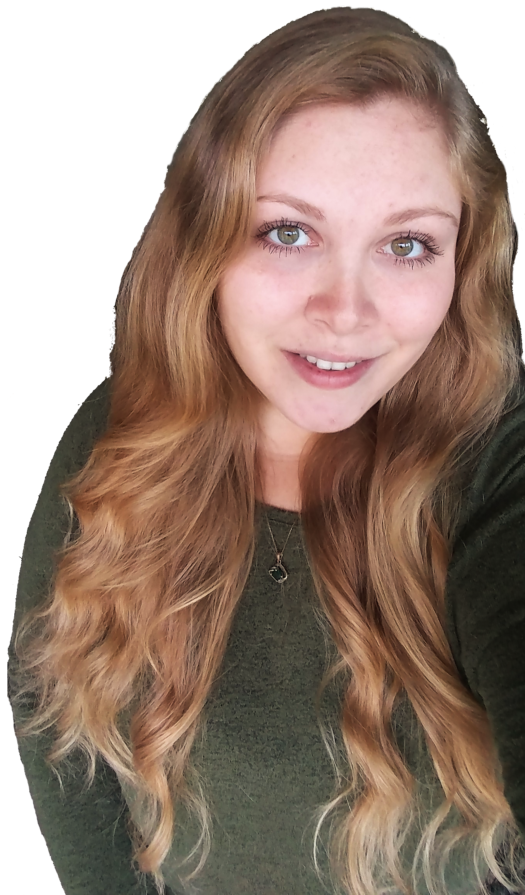

# {{page.title}}

{::options parse_block_html="true" /}
# Principle Investigator

## John M. Franck

John completed his PhD thesis under the guidance of
Prof. Alex Pines at Berkeley, studying sophisticated
methods of NMR pulse design and the development of
portable and transportable NMR instruments.
He worked as an Elings Prize Postdoctoral Fellow
(California NanoSystems Institute)
at the University of California, Santa Barbara,
under the guidance of Prof. Songi Han.
Here, he developed new, sensitive technologies for investigating
the properties of water at the surfaces of proteins,
polymers, lipids, and DNA.
He completed further postdoctoral studies and served as a
research associate at the Advanced Center for ESR
Technology (ACERT) at Cornell University,
under the guidance of Prof. Jack Freed.
There, he participated in studies that advanced the
forefront of high-field high-frequency pulse ESR;
techniques that provide detailed dynamic
characterizations of proteins and other biomolecular
systems.
These technologies are challenged only by difficulties
with probing samples that generated short-lived signal;
while at ACERT Prof. Franck pioneered
work that enabled detection of shorter-lived species than could
be proved previously.
After beginning his position at Syracuse University,
the Franck laboratory was opened in the summer of 2017.
Already, talented graduate students and undergraduate
researchers have begun to make exciting and innovative contributions.

<!-- click to continue is here: https://stackoverflow.com/questions/28334540/truncate-text-in-html-with-link-to-show-more-less-and-keep-elements-inside-->

# Postdocs

## Farhana Syed

Farhana comes to our group with extensive experience
working with proteorhodopsin,
and is aiding in the extensive site-directed
spin-labeling (SDSL) and isotopic expression of
proteorhodopsin.
She is also developing protocols for the SDSL of
transport and signaling proteins and will be analyzing
their hydration layers with ESR and ODNP.

# Graduate Researchers

## Alec Beaton

Alec will use LS-ODNP to study the behavior of
water in materials systems, such as reverse
micelles and other soft matter. He is interested
in integrating LS-ODNP measurements into
existing multidimensional NMR techniques to
obtain unique chemical information on these
systems. Toward these efforts, Alec has built a
15 MHz NMR spectrometer to perform ODNP, and he
maintains an interest in instrument development
and data processing. He is also involved in an
ongoing collaboration with Emily Ripka from Dr.
Maye's group studying diffusion of ligands at
nanoparticle surfaces through multidimensional
NMR techniques.
 

## Samantha M. Betts

Samantha completed her bachelor's degree at SUNY
Fredonia in spring 2017,
and was awarded the SU
Graduate Fellowship when she started as
a graduate student in Fall 2017,
and joined the Franck Lab a few months later.
Her current work includes simulated and experimental site-directed
spin labeling, as well as the
study of complex protein
environments *via* ODNP and ESR.

## Alexandria Guinness

Alexandria works on SDSL of proteorhodopsin,
and has begun developing protocols that employ
deuterium NMR relaxometry to analyze
"slowly" moving (ns-timescale) hydration waters,
beginning with reverse micelles and lipid bilayers as
model systems, and proceeding to proteorhodopsin and
other proteins.

# Undergraduate Researchers

## Eldon Hard

Eldon (planned graduation 2020) has worked both on the
design of specialized microwave cavities for ODNP, as
well as 
## Jazmine Richardson
Jazmine is a rising Sophomore here at Syracuse University 
and is participating in the Louis Stokes Alliance for Minority
Participation (LSAMP) REU for this summer and plans on continuing 
in the Franck lab during the fall. She is working on site-directed 
spin labeling mutant proteins to study the protein interactions 
through ESR and PRE.

## Katie Ackerman (REU 2019)

Katie is a visiting REU student from the University of
Hawaii. She is engineering a temperature apparatus that
will allow stable temperature controlled experiments to
be conducted during ODNP.

# Alumni

## Heta Desai (REU 2017)

Synthesized the small molecule spin label Cat-1,
demonstrated its capture inside lipid vesicles, and
demonstrated its saturation performance relative to
aminotempo.

## Isabela Ramirez (Undergrad)

Worked briefly to initialize a project on mechanical
automation of rf tuning and sample mixing.

## Soliloquy Rhodes (Undergrad)

Soliloquy (graduated 2019) worked on the synthesis of
small molecule spin labels as well as the design of an
automated temperature control system for use with
saturation-level microwaves.

## Michelle Sahagian (Undergrad)

Michelle (graduated 2019) worked on the synthesis of
small molecule spin labels.
