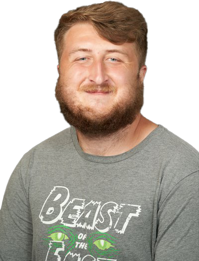

# {{page.title}}

{::options parse_block_html="true" /}
# Principle Investigator

## John M. Franck

John completed his PhD thesis under the guidance of
Prof. Alex Pines at Berkeley, studying sophisticated
methods of NMR pulse design and the development of
portable and transportable NMR instruments.
He worked as an Elings Prize Postdoctoral Fellow
(California NanoSystems Institute)
at the University of California, Santa Barbara,
under the guidance of Prof. Songi Han.
Here, he developed new, sensitive technologies for investigating
the properties of water at the surfaces of proteins,
polymers, lipids, and DNA.
He completed further postdoctoral studies and served as a
research associate at the Advanced Center for ESR
Technology (ACERT) at Cornell University,
under the guidance of Prof. Jack Freed.
There, he participated in studies that advanced the
forefront of high-field high-frequency pulse ESR;
techniques that provide detailed dynamic
characterizations of proteins and other biomolecular
systems.
These technologies are challenged only by difficulties
with probing samples that generated short-lived signal;
while at ACERT Prof. Franck pioneered
work that enabled detection of shorter-lived species than could
be proved previously.
After beginning his position at Syracuse University,
the Franck laboratory was opened in the summer of 2017.
Already, talented graduate students and undergraduate
researchers have begun to make exciting and innovative contributions.

<!-- click to continue is here: https://stackoverflow.com/questions/28334540/truncate-text-in-html-with-link-to-show-more-less-and-keep-elements-inside-->

# Graduate Students

&nbsp;

## Alexandria Guinness

Alex has automated large portions of the ODNP experiment and data
processing,
and performs detailed investigations to improve the sensitivity of the
ODNP measurement.
Currently, she applies these techniques to the study of hydration
water on the surface of Ras.

&nbsp;
&nbsp;

## Warren Kincaid

Warren has two projects:
In one, develops efficient protocols for site-directed spin labeling and
expression of the light-activated proton pump proteorhodopsin,
and investigates sites with anomalous hydration along the surface
or proteorhodopsin.
In the other project, he employes Ansys Electronics
to design dual NMR-ESR resonators with improved sensitivity.
He focuses on developing new simulation protocols that apply
broadly to the design of couple microwave resonators.

## Romana Shathy

Romana is a 1st year graduate student.
She synthesizes small molecule spin labels that allow her to probe the
microviscosity (*via* ESR)
and the local diffusivity (*via* ODNP) of small pockets of water.
Beginning with reverse micelles, she plans to expand her studies to
a variety of (especially energy-relevant) porous materials.

# Alumni

&nbsp; <!-- seems to be required to not gobble up next header -->

## Graduates and Postdocs 

### Alec Beaton

### Farhana Syed

## Undergraduates

| Eldon Hard | Began our project on the simulation of microwave resonators.  Graduated and enrolled in the PhD program at USC. |
| Heta Desai (REU 2017) | Synthesized the small molecule spin label Cat-1, demonstrated its capture inside lipid vesicles, and demonstrated its saturation performance relative to aminotempo. |
| Isabela Ramirez       |  Worked briefly to initialize a project on mechanical automation of rf tuning and sample mixing. |
| Soliloquy Rhodes | Soliloquy (graduated 2019) worked on the synthesis of small molecule spin labels as well as the design of an automated temperature control system for use with saturation-level microwaves. |
| Michelle Sahagian | (Graduated 2019) worked on the synthesis of small molecule spin labels. |
