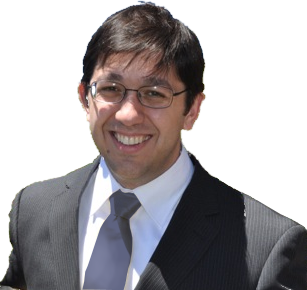

# {{page.title}}

{::options parse_block_html="true" /}
# Principle Investigator

## John M. Franck

John completed his PhD thesis under the guidance of
Prof. Alex Pines at Berkeley, studying sophisticated
methods of NMR pulse design and the development of
portable and transportable NMR instruments.
He worked as an Elings Prize Postdoctoral Fellow
(California NanoSystems Institute)
at the University of California, Santa Barbara,
under the guidance of Prof. Songi Han.
There, he developed new, sensitive technologies for investigating
the properties of water at the surfaces of proteins,
polymers, lipids, and DNA.
He completed further postdoctoral studies and served as a
research associate at the Advanced Center for the ESR
Technology Center (ACERT) at Cornell University,
under the guidance of Prof. Jack Freed.
There, he participated in studies that advanced the
forefront of high-field high-frequency pulse ESR;
techniques that provide detailed dynamic
characterizations of proteins and other biomolecular
systems.
These technologies are challenged only by difficulties
with probing samples that generated short-lived signal;
while at ACERT Prof. Franck pioneered
work that enabled detection of shorter-lived species than could
be proved previously.
After joining Syracuse as a PI and setting up his lab,
he received the NSF CAREER award (2022).
When ACERT expanded to become an independent 501(c)3 research nonprofit,
he relocated his lab to ACERT.

<!-- click to continue is here: https://stackoverflow.com/questions/28334540/truncate-text-in-html-with-link-to-show-more-less-and-keep-elements-inside-->

# Graduate Students

&nbsp;




## {{ person.name }}

*current {{ person.level }} student*

{{ person.description }}



# Alumni

&nbsp; <!-- seems to be required to not gobble up next header -->

## Graduates and Postdocs 



### {{ person.name }} (PostdocMS{{ person.level }})



{{ person.description }}


{{ person.description }}




## Undergraduates


| {{ person.name }} | {{ person.description | replace: "
", " " | strip }} |

